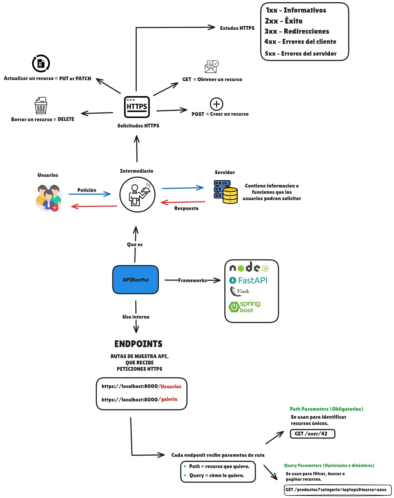

# Practica_Backend_FastAPI

Repositorio para practicar desarrollo backend con FastAPI, enfocado en buenas prácticas, escalabilidad y clean code. Ideal para crear APIs robustas y eficientes.

## Índice

1. [Introducción](#introducción)
2. [Requisitos Previos](#requisitos-previos)
3. [Estructura del Proyecto](#estructura-del-proyecto)
4. [Creación de Schemas](#creación-de-schemas)
5. [Manejo de Conexiones a la Base de Datos](#manejo-de-conexiones-a-la-base-de-datos)
6. [Configuración de Routers](#configuración-de-routers)
7. [Protección de Rutas](#protección-de-rutas)
8. [Middlewares](#middlewares)
9. [Autenticación con JWT](#autenticación-con-jwt)

## Introducción

El propósito de este proyecto es practicar y aplicar las mejores prácticas en el desarrollo backend de APIs utilizando FastAPI. Aunque el enfoque principal está en FastAPI, muchos de los conceptos y técnicas abordados son transferibles a otros frameworks, lo que lo convierte en una excelente base para construir APIs robustas y eficientes en diversos entornos.

### Diagrama 1

*Diagrama de funcionamiento basico de una API*

## Requisitos Previos

- Python 3.9+
- FastAPI
- Uvicorn
- SQLModel o SQLAlchemy (para manejo de base de datos)
- Pydantic (para validación de datos)

## Estructura del Proyecto

### Descripción de Archivos y Directorios

- **routes/**: Contiene los archivos de configuración de rutas para la API.
  - `__init__.py`: Archivo de inicialización del paquete.
  - `transaction_router.py`: Rutas relacionadas con transacciones.
  - `user_routes.py`: Rutas relacionadas con usuarios.

- **venv/**: Directorio del entorno virtual.

- **.gitignore**: Archivo para ignorar ciertos archivos y directorios en Git.

- **db.py**: Configuración y manejo de la base de datos.

- **main.py**: Punto de entrada principal de la aplicación FastAPI.

- **models.py**: Definiciones de modelos de datos.

- **mydb.db**: Archivo de la base de datos SQLite.

- **README.md**: Documentación del proyecto.

- **requirements.txt**: Lista de dependencias del proyecto.

## Creación de Schemas

[Descripción de cómo crear schemas...]

## Manejo de Conexiones a la Base de Datos

[Descripción del manejo de conexiones...]

## Configuración de Routers

[Descripción de la configuración de routers...]

## Protección de Rutas

[Descripción de la protección de rutas...]

## Middlewares

[Descripción de middlewares...]

## Autenticación con JWT

[Descripción de la autenticación con JWT...]
